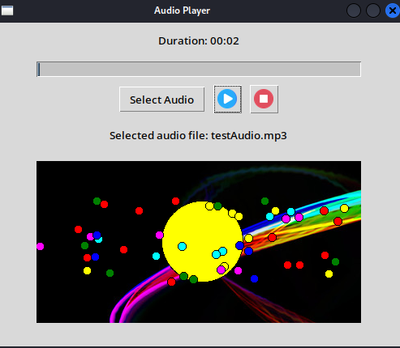

# Audio Player


The Audio Player is an interactive Python application that allows users to play audio files while enjoying captivating visual effects. It provides a seamless integration of audio playback and dynamic animations to enhance the listening experience.

## Features

- Audio Playback: Select and play audio files from your local machine.
- Play/Pause Control: Toggle between play and pause states.
- Stop Functionality: Stop the audio playback at any time.
- Visual Effects: Enjoy an animated circle that moves across the screen and changes color randomly.
- Smaller Circle Animation: Experience smaller circles moving within the boundaries of the larger circle.

## Usage

1. **Select Audio**: Click the "Select Audio" button to choose an audio file from your local machine.

2. **Play/Pause**: Click the play button to start the audio playback and initiate the visual effects. Click the pause button to temporarily suspend the playback and freeze the visual effects. Click the pause button again to resume playback and continue the visual effects.

3. **Stop**: Click the stop button to terminate the audio playback, reset the player, and stop the visual effects.

## Requirements

- Python 3.x
- Pygame library
- Tkinter library
- PIL (Python Imaging Library) library

## Installation

1. Clone the repository:

   ```shell
   git clone https://github.com/djefferson-saintilus/audio-player
   ```

2. Install the required dependencies:

   ```shell
   pip install pygame tkinter pillow
   ```

3. Run the application:

   ```shell
   python audioplayer.py
   ```

## Contributing

Contributions are welcome! If you have any suggestions, bug reports, or feature requests, please open an issue or submit a pull request.

## License

This project is licensed under the [MIT License](LICENSE).

## Acknowledgements

- [Pygame](https://www.pygame.org/) - Library for audio processing and animations.
- [Tkinter](https://docs.python.org/3/library/tkinter.html) - Library for creating the graphical user interface.
- [PIL (Python Imaging Library)](https://pillow.readthedocs.io/) - Library for image processing and loading.